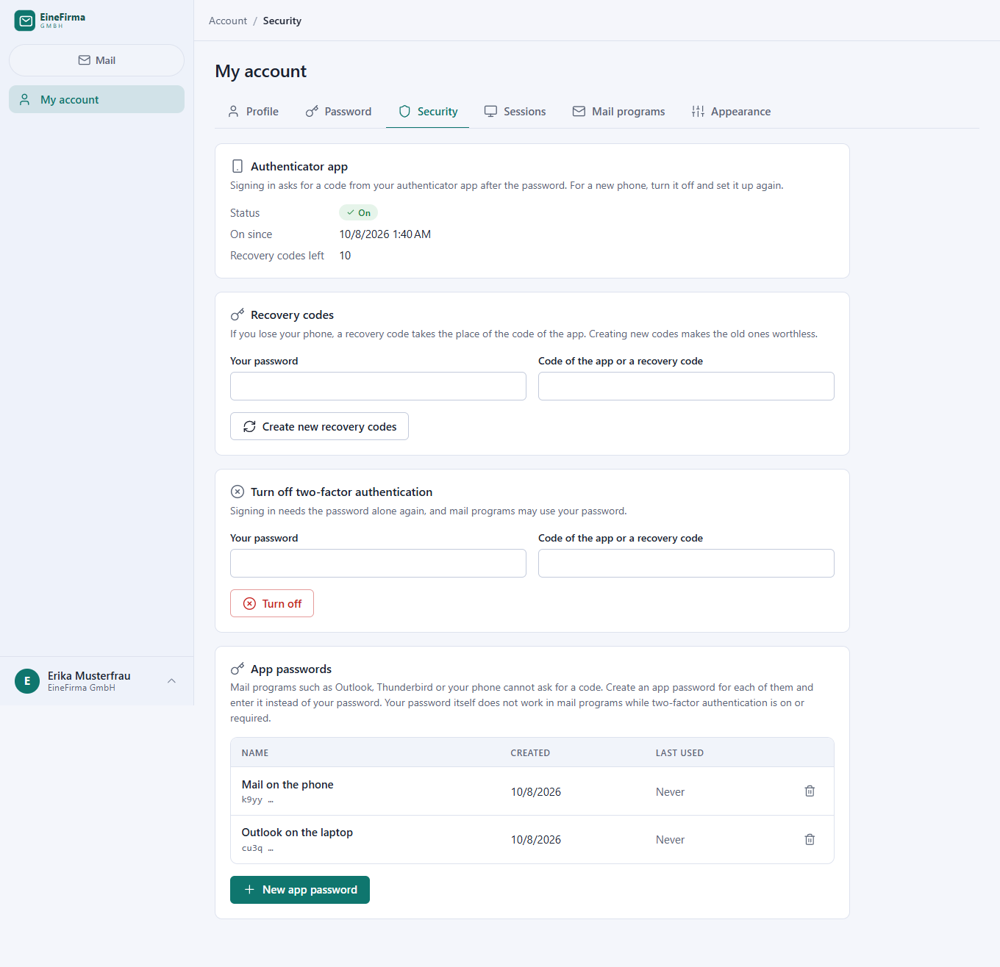

# MatMail

MatMail is a self-hosted **mail gateway with a built-in web mail client** – a bit like a tiny Exchange.
You connect the mail accounts you already have (Strato, Netcup, any IMAP/POP3/SMTP provider) once.
Your users then work with the gateway's own credentials: in the web client, in Outlook or Thunderbird
through the IMAP and SMTP servers of the gateway, or by sending through it as an SMTP smart host
(printers, scanners, scripts). The real provider credentials never leave the server, and a move to
another provider changes one record.

A hoster can give every customer an own **tenant** with their own domains, users, signatures and
branding.

## Quick start

Ready-made images are published to the GitHub Container Registry:

| Tag | Built from | Use it for |
|---|---|---|
| `ghcr.io/real-ttx/matmail:latest` | `main` | releases |
| `ghcr.io/real-ttx/matmail:nightly` | `dev` | the newest features |

### 1. Just run it

Copy this into `docker-compose.yml` and start it:

```yaml
services:
  matmail:
    image: ghcr.io/real-ttx/matmail:latest
    restart: unless-stopped
    depends_on:
      db:
        condition: service_healthy
    ports:
      - "9933:9933"   # web interface (HTTPS)
      - "25:25"       # SMTP: mail from other servers, relay for trusted networks
      - "587:587"     # SMTP submission (STARTTLS): mail programs
      - "465:465"     # SMTPS (TLS): mail programs
      - "143:143"     # IMAP (STARTTLS)
      - "993:993"     # IMAPS (TLS)
    environment:
      MATMAIL__Server__Hostname: mail.example.com
      MATMAIL__Database__Password: change-me
    sysctls:
      net.ipv4.ip_unprivileged_port_start: 0
    volumes:
      - matmail-data:/data

  db:
    image: postgres:17
    restart: unless-stopped
    environment:
      POSTGRES_PASSWORD: change-me
      POSTGRES_DB: matmail
    healthcheck:
      test: ["CMD-SHELL", "pg_isready -U postgres -d matmail"]
      interval: 5s
      timeout: 5s
      retries: 20
    volumes:
      - matmail-db:/var/lib/postgresql/data

volumes:
  matmail-data:
  matmail-db:
```

```bash
docker compose up -d
```

Open **https://your-server:9933**. The first visit asks for the name of the first tenant and the
administrator account (or set `MATMAIL_ADMIN_USER` and `MATMAIL_ADMIN_PASSWORD` for an unattended
start). The same file lives in the repository as `docker-compose.release.yml`.

- **Certificates.** Everything is encrypted. Without a certificate the app creates a self-signed one
  on the first start. Put your own into the data volume (`certs/fullchain.pem` + `certs/privkey.pem`,
  or `certs/server.pfx`) and it is picked up right away; **Server settings → TLS certificate** shows
  what is in use.
- **Behind a reverse proxy** that terminates TLS, set `MATMAIL__Server__WebHttps: "false"` and
  `MATMAIL__Server__TrustProxyHeaders: "true"`.
- **Updates:** `docker compose pull && docker compose up -d`. The database is migrated on start.
- **Backups:** the database volume and the data volume (`/data`: configuration, keys, certificates).
  Keep `/data/keys`: it protects the stored provider passwords and the secrets of the authenticator apps.
- **A lost second factor:** an administrator resets it on the user's page (*People → Users*). If the
  only administrator lost the phone and the recovery codes:
  `DELETE FROM "UserTotp" WHERE "UserId" = (SELECT "Id" FROM "User" WHERE "LoginName" = '…');`

### 2. First steps in the app

1. **Domains** – add the domains you receive mail for (*Mail → Domains*).
2. **Users and mailboxes** – create the people; a personal mailbox is made for each (*People → Users*).
   Shared mailboxes (info@, support@) are delegated to users with their own rights.
3. **Connected accounts** – connect the provider accounts (*Mail → Connected accounts*): incoming
   server (IMAP or POP3), outgoing server, and what happens to the mail on the provider. Mail is
   routed by recipient address to the mailboxes; what fits nowhere lands in **Unassigned**.
4. **Mail programs** – every user finds the data for Outlook, Thunderbird and phones under
   *My account → Mail programs* (server, ports, user name).
5. **Smart host** – let printers and scripts send without signing in (*Delivery → SMTP relay*).
6. **Signatures, footers, templates** – see below.

### 3. From source

```bash
./scripts/redeploy.ps1        # rebuilds the image and recreates the dev stack (http://localhost:9933)
./scripts/redeploy.ps1 -Fresh # …after wiping the volumes: the setup page appears again
dotnet test MatMail.slnx      # see "Development"
```

## Screenshots

Taken from a demo instance with made-up data (English UI; German is built in).

| | |
|---|---|
|  |  |
| **Web client** – a modern, Gmail-like mail client | **Reader** – foreign HTML (T-Online, WEB.DE, Outlook …) shown so that it looks right; remote pictures stay blocked until you allow them |
|  |  |
| **Plain text in, HTML out** – what a printer sent, put into a template, with signature and legal footer | **Templates** – chosen by sender, by where the message comes from and by smart-host rule |
|  |  |
| **Signatures** – rich text, pictures, placeholders; offered in the client and, if wanted, added by the server | **Connected accounts** – the provider accounts, their state and what happens to the mail |
|  |  |
| **Security** – authenticator app, recovery codes and app passwords for mail programs | **Dashboard** – what runs, what is queued, what happened |
|  |  |
| **SMTP relay** – trusted networks send without signing in | **Branding** – name, logo and colour per tenant |

**Look.** Light, dark or system, seven accent colours, text size, density and time zone per user;
the mail client is a first-class phone app too.

<p>
  
  
</p>
<p>
  
  
  
</p>

## Features

### Mail in, mail out
- **Connected accounts** (IMAP, POP3, SMTP) with a role: everyday *mail*, a *backup* that only
  copies, a *migration* that moves a whole account from an old provider, or *send only*. Per account
  you decide what happens on the provider – keep the original, delete it after the download, or
  *live access* (nothing is stored; lists and bodies come from the provider when needed) – plus
  the folders to follow and the interval. Flags and deletions are synchronised both ways.
- **Routing by address.** A recipient address belongs to a mailbox; **catch-all** accounts hand
  everything of a domain to one mailbox; mail that fits nowhere waits in **Unassigned** until an
  administrator assigns it.
- **Own IMAP and SMTP servers** for Outlook, Thunderbird and phones: STARTTLS and implicit TLS,
  per-user rights, push (IDLE). Sign-in per address or login name, throttled per client and login;
  open sessions follow what administrators change.
- **Smart host.** Networks you trust may relay without signing in (optionally limited to sender
  domains) – printers, scanners, internal servers.
- **Outgoing queue** with retries and bounce messages; sending goes through the provider account
  of the sender address, or directly (MX lookup) when none is configured.

### The web client
- Folders (also those of the provider), search, stars, drafts with auto-save, attachments,
  address suggestions from your contacts; shared mailboxes and mailboxes delegated by others,
  live updates when mail arrives.
- **A reader that copes with what the world sends:** foreign HTML is sanitised, shown in a sandboxed
  frame, scaled to fit the width, quoted history folded, remote images blocked until you allow them;
  dark mode follows the theme.
- Compose with rich text, pictures (paste or drop), signature chooser, keyboard shortcuts.
- First-class mobile layout.

### Signatures, footers and templates
- **Signatures** with a rich text editor (formatting, links, lists, colours, pictures, HTML source).
  Placeholders such as `{{FullName}}`, `{{Salutation}}`, `{{JobTitle}}`, `{{Phone}}`, `{{Mobile}}`,
  `{{Website}}` come from the user's profile; a line whose placeholders are all empty is left out.
  Scope: whole tenant, one mailbox or one user.
- A signature is **offered in the web client** and – if you want – also **appended by the server**
  to messages of mail programs and smart hosts that carry none. **Footers** (legal notice) are added
  to every outgoing message and cannot be removed by the sender. Pictures travel as inline parts.
- **Templates by rule**: an HTML frame with `{{Body}}` chosen by who sends, where the message comes
  from (web client, mail program, a given smart-host rule) and whether it has an HTML part. The plain
  text of a printer becomes an HTML mail in the look of the company; the text stays next to it.
  Signed and encrypted messages are never touched.

### Tenants, people and rights
- **Tenants** with their own domains, mailboxes, users, roles, signatures and branding; system
  administrators switch between them. Addresses are unique on the server, so mail between tenants is
  local mail.
- **Roles** with fine-grained permissions; access to somebody else's mailbox is **delegated**
  separately, so administrators do not read mail by default.
- **Branding per tenant**: name, logo, accent colour, website – shown in the app, on the tenant's own
  sign-in page (`/t/<name>`) and as `{{Website}}` in signatures.
- **Two-factor authentication** with an authenticator app (TOTP) and recovery codes. It can be switched
  on by everybody, or made mandatory for the administrators or for all users of a tenant, or for the
  members of a role. Mail programs cannot ask for a code, so they sign in with **app passwords**:
  one per device, shown once, revocable, valid for IMAP and SMTP only. As long as two-factor
  authentication is on or required, the account password does not work in mail programs.
- **Sessions** live in the database (they survive restarts, can be revoked, are listed under *My
  account*). Failed sign-ins are throttled. Activity log for sign-ins, SMTP, IMAP, synchronisation
  and the queue.

### Look and language
- English and German (English by default; the user or the browser decides).
- Per user: light/dark/system theme, accent colour, text size, density, time zone, message previews.

## Configuration

Settings live in `/data/config/app.json` (edited under *Server settings*) and can be overridden by
environment variables `MATMAIL__Section__Key`:

| Variable | Meaning | Default |
|---|---|---|
| `MATMAIL__Server__Hostname` | name of the server (certificate, greeting) | `localhost` |
| `MATMAIL__Server__WebHttps` | HTTPS for the web interface | `true` |
| `MATMAIL__Server__TrustProxyHeaders` | trust `X-Forwarded-*` of a reverse proxy | `false` |
| `MATMAIL__Database__Host` / `Port` / `Database` / `Username` / `Password` | PostgreSQL | `db` / `5432` / `matmail` / `postgres` / `matmail` |
| `MATMAIL__Smtp__Port` / `SubmissionPort` / `ImplicitTlsPort` | SMTP ports | `25` / `587` / `465` |
| `MATMAIL__Imap__Port` / `ImplicitTlsPort` / `MaxConnections` | IMAP ports, overall connection limit | `143` / `993` / `500` |
| `MATMAIL__Queue__AllowDirectDelivery` | deliver directly (MX) when no provider account fits | `true` |
| `MATMAIL__Display__TimeZone` / `Culture` | defaults for dates and language | `Europe/Berlin` / `en-US` |
| `MATMAIL_ADMIN_USER`, `MATMAIL_ADMIN_PASSWORD` | create the first tenant and administrator unattended | – |
| `MATMAIL_DATA` | data directory | `/data` |

## Tech stack

- **.NET 10**, ASP.NET Core **Razor Pages** with TagHelper controls – no SPA framework
- **PostgreSQL** (Npgsql / EF Core 10) for the logic and the mail, JSON for the configuration
- **MailKit / MimeKit**, own IMAP and SMTP servers
- Runs entirely in **Docker**

## Development

```bash
dotnet build MatMail.slnx
dotnet test MatMail.slnx
```

Most tests need a PostgreSQL server (`MATMAIL_TEST_DB`, e.g. the database of the dev stack) and are
skipped without it; the synchronisation tests also need a GreenMail test server
(`MATMAIL_TEST_IMAP`, see `tests/MatMail.Tests/Support/TestProvider.cs`). The CI starts both.

UI text is English in the source; German lives in `src/MatMail/Resources/SharedResource.de.resx`
(`node tools/i18n.mjs check` lists what is missing). `CLAUDE.md` describes the architecture and the
project rules, `BACKLOG.md` what is planned.

### Branches and versions

| Branch | Purpose | Image tag |
|---|---|---|
| `main` | release | `<major>.<minor>.<build>-<date>`, `latest` |
| `dev` | development | `nightly-<build>-<date>`, `nightly` |
| local build | `scripts/redeploy.ps1` | `local-<date>` |

The GitHub Action (`.github/workflows/docker.yml`) builds, tests and pushes the image.
